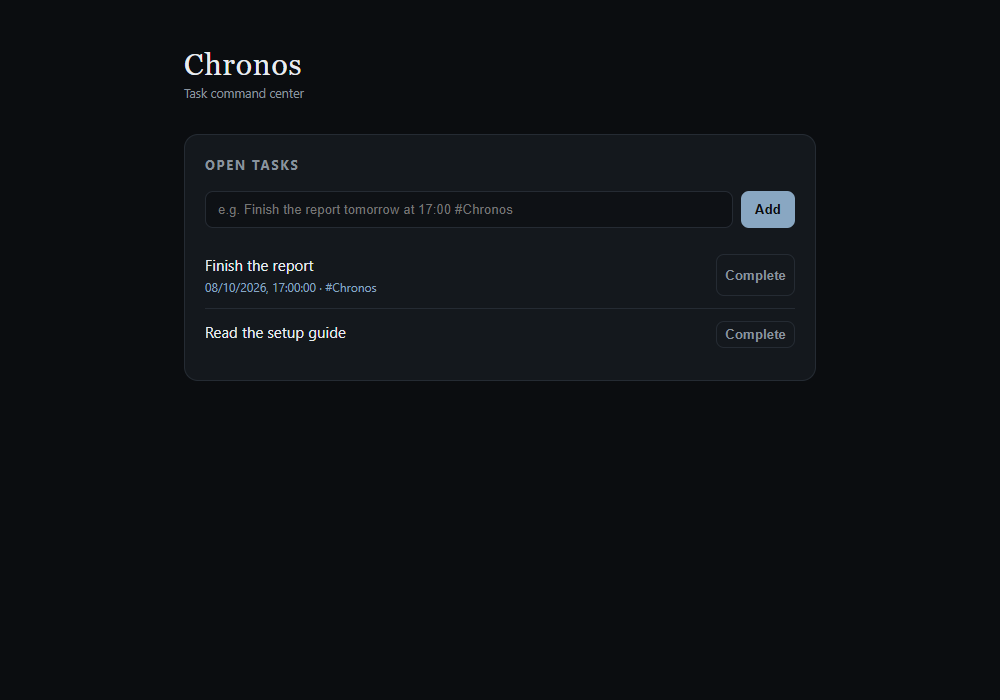

# Chronos — Telegram Task Assistant

**Turn Chinese or English messages into personal tasks, manage them in your own Telegram bot, and receive a daily list of unfinished tasks.**

[繁體中文](README.md) · [Local demo](docs/demo.md) · [Report a problem](https://github.com/Yili-code/Chronos/issues/new/choose)

[](https://github.com/Yili-code/Chronos/actions/workflows/ci.yml)

Chronos is a self-hosted, single-user task assistant. Gemini handles natural-language task input; SQLite stores local data, with Firestore available for Cloud Run deployments. Telegram is the main interface, with a Web dashboard for viewing, adding and completing tasks.

Version `0.1.0` is in development. There is no License file or GitHub Release yet; clarify licensing before redistribution or code contributions. There is no shared public bot or hosted demo. The Study integration contains NTOU / TronClass-specific course and cloud settings and is disabled by default.

## Preview without an API key



This is the real Web interface with synthetic tasks, not evidence of live Gemini parsing or Telegram delivery. After installing the project below, run:

```powershell
.\.venv\Scripts\python.exe scripts/demo_local.py
```

On macOS / Linux, use `.venv/bin/python scripts/demo_local.py`. Open <http://127.0.0.1:8000>. You can complete the two sample tasks. **Add returns a configuration error in this demo**, because Gemini is disabled. The demo uses a temporary database and overrides external-service settings; it does not connect to services configured in your `.env`. Stop it with Ctrl+C before starting the regular app on the same port.

## Install and start

Requires Git and Python 3.11 or later. CI covers Python 3.11 and 3.12. From a directory where you want to clone the project:

Windows PowerShell:

```powershell
git clone https://github.com/Yili-code/Chronos.git
cd Chronos
python -m venv .venv
.\.venv\Scripts\python.exe -m pip install uv==0.12.3
.\.venv\Scripts\uv.exe sync --locked --extra dev
if (!(Test-Path .env)) { Copy-Item .env.example .env }
.\.venv\Scripts\uv.exe run uvicorn chronos.main:app --host 127.0.0.1 --port 8000
```

macOS / Linux:

```bash
git clone https://github.com/Yili-code/Chronos.git
cd Chronos
python3 -m venv .venv
.venv/bin/python -m pip install uv==0.12.3
.venv/bin/uv sync --locked --extra dev
test -f .env || cp .env.example .env
.venv/bin/uv run uvicorn chronos.main:app --host 127.0.0.1 --port 8000
```

Open <http://127.0.0.1:8000>. A fresh database shows **No open tasks.**; <http://127.0.0.1:8000/live> returns `{"status":"live"}` and <http://127.0.0.1:8000/ready> reports `status: ready`. These checks do not prove external services are available.

## Create your first task

Get your own key from [Google AI Studio](https://aistudio.google.com/apikey), then edit the existing fields in `.env`:

```dotenv
CHRONOS_GEMINI_API_KEY=YOUR_API_KEY
CHRONOS_GEMINI_MODEL=gemini-3.8-flash
```

The model must be available to your account; see [Google's model list](https://ai.google.dev/gemini-api/docs/models). Provider fees and limits apply. Restart the regular app, enter `Finish the report tomorrow at 17:00 #Chronos`, and select **Add**. Check the interpreted date, then select **Complete**.

Your input and current time are sent to Gemini, without the full task list. Titles are stored in concise English; the original Chinese input for a newly created task is not retained separately. Failed parsing or unavailable AI does not create a task. There is no offline parsing fallback.

## Connect your own Telegram bot

1. Create a bot with [BotFather](https://t.me/BotFather), then send it `/start`.
2. For a new bot without a webhook, obtain your private `message.chat.id` using [getUpdates](https://core.telegram.org/bots/api#getupdates). Do not share token-bearing URLs. getUpdates cannot be used while a webhook is active.
3. Set all four fields below, using your own HTTPS public endpoint. Telegram cannot reach a loopback-only server.

```dotenv
CHRONOS_TELEGRAM_BOT_TOKEN=YOUR_BOT_TOKEN
CHRONOS_TELEGRAM_CHAT_ID=YOUR_INTEGER_CHAT_ID
CHRONOS_TELEGRAM_WEBHOOK_SECRET=YOUR_LONG_RANDOM_SECRET
CHRONOS_PUBLIC_BASE_URL=https://YOUR_PUBLIC_ENDPOINT
```

Before exposing the Web interface, set `CHRONOS_WEB_PASSWORD` and use HTTPS. The default username is `chronos`. Restarting attempts to register `/telegram/webhook`; a running Web page does not prove registration succeeded.

Try this in your own bot:

```text
Finish the report tomorrow at 17:00 #Chronos
/tasks
/edit 1 remove the due date
/tasks
/done 1
```

Confirm position `1` before each action: open tasks are sorted by deadline. Listing and completion do not require AI; semantic edits may. The daily digest runs at 08:00 in the configured timezone (`Asia/Taipei` by default), requiring a running service or an external scheduler. It is not a separate alert at every task's deadline. Chronos has no multi-user account isolation.

## Troubleshooting and reference

| Problem | Check |
| --- | --- |
| Missing Python module | Use the virtual environment's Python and repeat the install command. |
| Web works but Add fails | Verify Gemini key, model availability and quota; restart after editing `.env`. |
| Web returns 401 | Use your configured Web username and password. |
| Telegram does not reply | Check HTTPS webhook, all four bot settings, chat ID and whether the bot is blocked. |
| Port 8000 is occupied | Use `--port 8001` and open port 8001 instead. |

Detailed setup, Docker, command semantics, deployment and Study records are currently in Traditional Chinese: [setup](docs/getting-started.md), [commands](docs/usage.md), [deployment](docs/deployment.md), [document index](docs/README.md). Read the [extension's English data-flow guide](chrome-extension/README.md) before enabling Study browser capture or session handoff.

Report reproducible setup problems or documentation errors with your OS, Python version, commit and sanitized steps. Never attach `.env`, tokens, cookies, personal tasks or school materials. See [CONTRIBUTING](CONTRIBUTING.md) for the current licensing status. If Chronos is useful to you, a Star can help you find it later.
